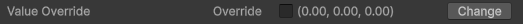
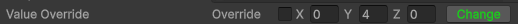

# User Defined Types (UDTs)

This **PsigenVision.Utilities.Native** module provides a growing collection of **User Defined Types (UDTs)** — carefully designed, low-level data structures that solve common problems in Unity development. These UDTs prioritize performance, inspector usability, and code clarity.

**Value Override UDTs** is the first submodule.

---  

## Background

A [user defined type (UDT)](https://www.geeksforgeeks.org/cpp/c-user-defined-data-types/) is a data structure that allows you to define your own custom data types. UDTs can be used to create data structures of varying levels of complexity that can be used to store and manipulate data in a more organized and efficient manner. While UDTs could technically be classifed as derived types, this module attempts to differentiate UDTs from other derived types by focusing on low-level data structures whose usefullness is not limited to any specific application.
  
---  
## Submodules
**I. Value Override UDTs**

Value override types are low-level data structures that allow you to define both a default and override value for a given data type on a per-instance basis. 


---  

## Submodule 1: Value Override UDTs

### Overview

**Value Override UDTs** are lightweight structs that let you store both a **default value** and an **override value** for any type, controlled by a `doOverride` boolean.

They are designed to feel like native value types in code (via implicit conversions and the `!` operator) while providing powerful, designer-friendly behavior in the Unity Inspector.


### Motivation

The scenario which motivated the creation of these UDTs was the need to provide the user with the ability to override a value via the inspector, and also provide an indication within script of the user's decision to do or not do so. 

More specifically, within a scriptable object, `VehicleSettings`, an option to override different properties of various component of the controlled vehicle, such as the `Rigidbody` component, `WheelCollider` components, etc, was needed to provide flexible customization for a wheeled vehicle controller. Whether or not the user chose to perform various overrrides would affect runtime initialization. The added requirement that resulted in these UDTs' creation was permitting scripts to be aware of the user's choice, such that, if no override was requested for a given property, initialization of that property could be skipped for added performance.  

These combined requirements resulted in structs that encapsulated a default value, an override value, and a boolean `doOverride` boolean flag. The natural evolution of this design was a UDT whose purpose was to transform defined types into binary value versions of themselves. While the use case of inspector customization is highly applicable, it is certainly not the full extent of these UDTs' usefulness. Any instance in which a value contains two states invites application of the Value Override UDT. 

The following are merely a few examples:
- a controller with a boost/run and cruise/walk speed factor - `FloatOverride` 
- a raising platform with a top and bottom position value - `Vector3Override`
- an altered acceleration curve for a functional vs damaged engine - `AnimationCurveOverride`
- inspector GUI area whose height varies based on another value's state - `RectOverride`

## Benefits & Limitations

**Benefits**
- Struct-based → minimal GC pressure
- Implicit conversions make them feel like native types
- Excellent inspector integration
- Clear intent communication (`doOverride`)

**Limitations**
- Roughly doubles memory usage compared to a single value (usually negligible)
- Requires manual concrete implementations due to Unity’s generic serialization limitations


### Contents

All Value Override UDTs share the same structure/architecture, with an additional generic `ValueOverride<T>` that serves as a generic value type useful for substituting any other Value Override UDTs not already present non-generically in this package. All concrete manual implementations (e.g. `Vector3Override`, `IntOverride`, etc) are provided with a custom property drawer. 

#### Shared Structure
All Value Override UDTs share the same structure depicted by the following, where `ValueOverride` is the value override UDT's type and `T` its corresponding value type:

_Private Serialized Fields_:
1. `bool doOverride`
2. `T defaultValue`
3. `T overrideValue`

_Public Read/Write Properties_:
1. `T Value`
2. `T Override`

_Public Read-Only Properties_:
1. `T Default`

_Public Methods_:
1. `void Toggle()`
2. `void ResetDefaultValue(T newDefaultValue)`

_Implicit Operators_:
1. `implicit operator T(ValueOverride<T> valueOverride)`
2. `implicit operator ValueOverride<T>(T value)`

_Explicit Operators_:
1. Unary `!` operator override

_Constructors_:
1. `ValueOverride(bool doOverride, T defaultValue, T overrideValue)`
2. `public ValueOverride(bool doOverride, ValueOverride<T> value)`

The currently implemented value override UDTs are the following:
1. `ValueOverride<T>`
2. `FloatOverride`
3. `IntOverride`
4. `StringOverride`
5. `CharOverride`
6. `Vector3Override`
7. `Vector2Override`
8. `Vector4Override`
9. `Vector2IntOverride`
10. `Vector3IntOverride`
11. `QuaternionOverride`
12. `LayerMaskOverride`
13. `ColorOverride`
14. `RectOverride`
15. `RectIntOverride`
16. `AnimationCurveOverride`
17. `BoundsOverride`
18. `BoundsIntOverride`
19. `GradientOverride`
20. `RenderingLayerMaskOverride`
21. `Hash128Override`
22. `EntityIdOverride`


#### Custom Property Drawer
All UDTs _except for the generic `ValueOverride<T>`_ support the custom property drawer `ValueOverrideDrawer`. This property drawer draws the following inspector:
1. A toggle field for `doOverride` labeled "_Override_".
2. When the _Override_ toggle is not checked, a read-only label field for the currently retained default value, `defaultValue`, is displayed.



3. When the _Override_ toggle is not checked, a button titled "_Change_" is displayed next to the read-only label field that, when checked, turns the label field into an editable property field that will update the default value, `defaultValue`.




4. When the _Override_ toggle is checked, the default value field and _"Change"_ button are replaced by an editable property field for the currently retained override value, `overrideValue`.


_Note: The generic ValueOverride<T> does not currently have a custom drawer due to Unity limitations._

---  
**Here is the API documentation** generated in your exact requested format.

---

### API

#### 1. `ValueOverride<T>`

**Namespace:** `PsigenVision.Utilities`

##### Overview
`ValueOverride<T>` is a generic, serializable struct that represents a value of type `T` which can be conditionally overridden. It stores both a default value and an override value, along with a boolean flag (`doOverride`) that determines which value is returned via the `Value` property.

##### Motivation
In editor tools, runtime debugging, and configurable systems (especially in Unity), it is common to want to temporarily force a specific value without permanently changing the underlying data or breaking existing logic. This struct solves the challenge of scattering manual if-statements throughout code by encapsulating the override logic into a reusable, inspector-friendly data structure with implicit conversions and clean syntax.

##### Key Features
- Clean implicit conversion to `T` (behaves like the underlying value)
- Implicit conversion from `T` (creates a non-overriding wrapper)
- `!` operator support for quick toggling
- Fully Unity-serializable with custom inspector support on concrete types
- Thread-safe value access pattern (no side effects on read)

---

##### Methods

###### 1. `Value` (Property)
```c
public T Value { get; }
```

- **Description**:  
  Returns the current effective value — either the override or the default depending on the `doOverride` flag.

- **Parameters**: None

- **Returns**:
  - `T`: The active value.

- **Usage**:
```c
float effectiveSpeed = speedOverride.Value; // automatically uses override or default
```

---

###### 2. `Default` (Property)
```c
public T Default { get; }
```

- **Description**:  
  Retrieves the stored default value (never affected by the override state).

---

###### 3. `Override` (Property)
```c
public T Override { get; set; }
```

- **Description**:  
  Gets or sets the override value.

---

###### 4. `Toggle()`
```c
public void Toggle()
```

- **Description**:  
  Flips the `doOverride` flag, switching between default and override values.

---

###### 5. `ResetDefaultValue(T newDefaultValue)`
```c
public void ResetDefaultValue(T newDefaultValue)
```

- **Description**:  
  Updates the cached default value.

---

###### 6. Constructor
```c
public ValueOverride(bool doOverride, T defaultValue, T overrideValue)
```

- **Description**:  
  Creates a new `ValueOverride<T>` with explicit control over all fields.

---

###### 7. Copy Constructor
```c
public ValueOverride(bool doOverride, ValueOverride<T> value)
```

---

###### 8. Implicit Operator `T`
```c
public static implicit operator T(ValueOverride<T> valueOverride)
```

- **Description**:  
  Allows the struct to be used directly as type `T`.

---

###### 9. Implicit Operator `ValueOverride<T>`
```c
public static implicit operator ValueOverride<T>(T value)
```

- **Description**:  
  Creates a non-overriding wrapper around a value.

---

###### 10. Unary `!` Operator
```c
public static ValueOverride<T> operator !(ValueOverride<T> valueOverride)
```

- **Description**:  
  Returns a new instance with the override state toggled.

---

##### Expansion Roadmap

Potential improvements and extensions for **`ValueOverride<T>`** include:
- **Editor Experience**:
  - Generic custom property drawer (when Unity supports it better, or if Nerdbank.MessagePack is integrated)
  - Context menu actions (Reset, Copy Override to Default, etc.)
- **Additional Operators**:
  - Equality / inequality operators with `T` and between `ValueOverride<T>`
- **Performance / Safety**:
  - `readonly` struct variant
  - Source generators for automatic specialized types

---

#### 2. `StringOverride` (and other concrete overrides)

**Namespace:** `PsigenVision.Utilities`

##### Overview
`StringOverride` is a concrete, non-generic implementation of the `ValueOverride<T>` pattern specialized for `string`. All other concrete overrides (`FloatOverride`, `IntOverride`, `Vector3Override`, etc.) follow the exact same structure and public API.

##### Motivation
While the generic `ValueOverride<T>` works in code, Unity’s inspector and serialization often require concrete types for proper custom property drawers and better editor UX. These specialized structs provide the same behavior with full inspector support.

##### Key Features
- Identical public API to `ValueOverride<string>`
- Custom Inspector support (as mentioned in your example)
- Full serialization compatibility

---

##### Methods

All methods mirror the generic version exactly, with `T` replaced by `string`:

- `string Value { get; }`
- `string Default { get; }`
- `string Override { get; set; }`
- `void Toggle()`
- `void ResetDefaultValue(string newDefaultValue)`
- Constructors, implicit operators, and `!` operator

**Example usage** (identical pattern for all concrete types):
```c
StringOverride titleOverride = "Default Title";
titleOverride.Override = "Special Title";

titleOverride.Toggle(); // Toggles to override state
string overrideTitle = titleOverride; // implicit conversion

titleOverride.Toggle(); // Toggles back to default state
string defaultTitle = titleOverride; // implicit conversion
```

---

##### Expansion Roadmap

- Generate remaining concrete types (e.g. `PoseOverride`, etc.) via source generator.

---

### Expansion Roadmap

#### Serialization Improvements
- Replace manual concrete implementations with a robust generic serialization solution (e.g. **Nerdbank.MessagePack** custom converters)
- Maintain or improve existing custom property drawer support

#### Developer Experience
- Source generator to automatically create concrete types (`FloatOverride`, `Vector3Override`, etc.)
- Additional operators (`==`, `!=`, explicit casting)
- Context menu actions in the inspector (Reset to Default, Copy Override → Default, etc.)

#### New UDTs
- More specialized overrides as needed (`PoseOverride`, `TransformOverride`, etc.)

---
## Future Work
- Introduce more UDTs as they emerge during development.
- Potentially transfer over the special _Tagged Union_ UDT currently implemented as its own package - [Low-Allocation-Tagged-Unions-for-Unity](https://github.com/kokogamedev/Low-Allocation-Tagged-Unions-for-Unity).
- Potentially integrate with [Nerdbank.MessagePack](https://github.com/nerdbank/MessagePack-CSharp) for improved serialization.

## Final Notes

The PsigenVision.Utilities.Native package is currently still in **Alpha**. UDTs are subject to change as the module evolves. This documentation will be updated as the module progresses.